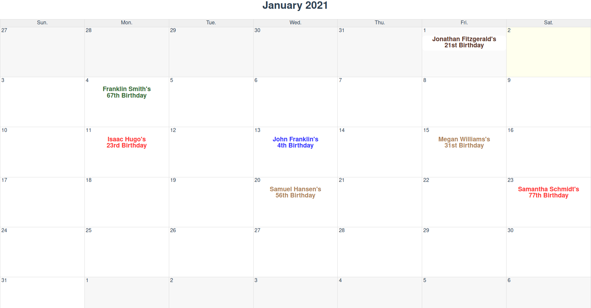

# bday

Birthday is a simple birthday calendar that runs entirely on the client side. 

* Add birthdays and anniversaries of relatives
* Colour-coded
* Automatically calculates age of each person

## Example 




# Developing

## Project setup
```
yarn install
```

### Compiles and hot-reloads for development
```
yarn serve
```

### Compiles and minifies for production
```
yarn build
```

### Lints and fixes files
```
yarn lint
```

### Customize configuration
See [Configuration Reference](https://cli.vuejs.org/config/).
